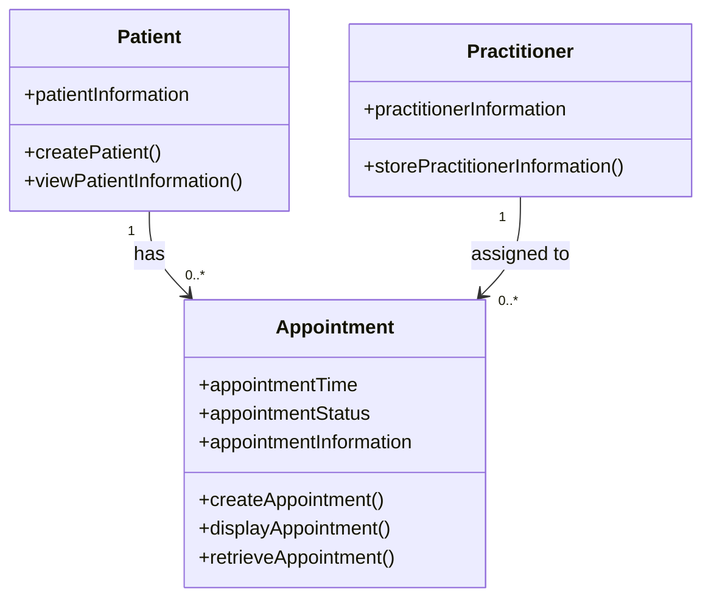

# SmartCare Domain Modelling – Stage 3

## PART A - Requirements Review

The SmartCare Stage 2 requirements were reviewed to identify important nouns, verbs and business rules that can be used to develop the domain model.

### Nouns

The main nouns identified from the requirements are:

- Patient
- Practitioner
- Appointment
- Staff
- Appointment status
- Appointment history
- Patient information
- Practitioner information
- Appointment information

### Verbs

The main actions identified from the requirements are:

- Create patient records
- View patient information
- Store practitioner information
- Create appointments
- Display appointment information
- Prevent duplicate bookings
- Store appointment status
- Retrieve appointment information
- Maintain appointment history
- Associate appointments with patients and practitioners

### Business Rules

- Each appointment must be associated with a patient and a practitioner.
- A practitioner cannot have two appointments at the same time.
- Appointment information must include the patient, practitioner, time and status.
- Appointment status must be stored consistently.
- Previous appointments must be available as appointment history.
- Patient, practitioner and appointment information must be stored by the system.

## PART B - Candidate Classes

| Candidate Class | Supporting Requirements | State | Behaviour |
|---|---|---|---|
| Patient | FR-01, FR-02, FR-04, FR-09, FR-10 | Patient information | Create patient record, view patient information, access appointment history |
| Practitioner | FR-03, FR-04, FR-06, FR-10 | Practitioner information | Store practitioner information, check appointment availability |
| Appointment | FR-04, FR-05, FR-06, FR-07, FR-08, FR-09, FR-10 | Patient, practitioner, time, status | Create appointment, display appointment, retrieve appointment, store status, prevent duplicate booking |

### Candidate Class Decisions

**Patient** is included as a class because the system needs to create and store patient records and associate patients with appointments.

**Practitioner** is included as a class because practitioner information must be stored and practitioners are associated with appointments.

**Appointment** is included as a class because appointments contain their own information and behaviour, including time, status and relationships with patients and practitioners.

**Staff** was identified as a noun but is not currently included as a main domain class because the confirmed requirements describe staff mainly as users of the system. Specific staff information and permissions have not yet been defined.

## PART C - CRC Cards

CRC cards were created for the main classes identified from the SmartCare requirements.

### Patient

| Responsibilities | Collaborators |
|---|---|
| Store patient information | Appointment |
| Provide patient information when required | Appointment |
| Be associated with appointments | Practitioner |

### Practitioner

| Responsibilities | Collaborators |
|---|---|
| Store practitioner information | Appointment |
| Be associated with appointments | Patient |
| Have appointments assigned to them | Appointment |

### Appointment

| Responsibilities | Collaborators |
|---|---|
| Store appointment information | Patient |
| Associate a patient with a practitioner | Practitioner |
| Store appointment time and status | Patient, Practitioner |
| Prevent duplicate practitioner bookings at the same time | Practitioner |
| Maintain appointment information for appointment history | Patient |

## PART D - UML Model

The UML class diagram below represents the main classes, attributes, operations, associations and multiplicities identified from the confirmed SmartCare requirements.

## PART E - AI Design Review

AI was asked to review the SmartCare design and suggest classes and relationships using only the confirmed requirements from Stage 2. Each suggestion was required to include supporting requirement IDs.

| AI Suggestion | Supporting Requirements | Reason |
|---|---|---|
| Patient should be a class | FR-01, FR-02 | The system must create patient records and allow patient information to be viewed. |
| Practitioner should be a class | FR-03 | The system must store practitioner information. |
| Appointment should be a class | FR-04, FR-05, FR-07, FR-08 | The system must create, display, store and retrieve appointment information. |
| Patient should have a relationship with Appointment | FR-04, FR-10 | Appointments are created for a patient and each appointment must be associated with the relevant patient. |
| Practitioner should have a relationship with Appointment | FR-04, FR-06, FR-10 | Appointments are created for practitioners and each appointment must be associated with the relevant practitioner. |
| Appointment History could be a separate class | FR-09 | The system must maintain appointment history. |
| Staff could be a separate class | No confirmed requirement | Staff are mentioned in the requirements, but their specific information, roles and permissions have not been confirmed. |

## PART F - Compare and Decide

The AI design suggestions were compared with the confirmed SmartCare requirements before deciding whether they should be included in the final design.

| AI Suggestion | Decision | Reason |
|---|---|---|
| Use Patient, Practitioner and Appointment as the main classes | Accepted | These classes are directly supported by FR-01, FR-02, FR-03, FR-04 and FR-05 and represent the main information managed by the system. |
| Create Appointment History as a separate class | Modified | FR-09 confirms that appointment history must be maintained, but it does not require a separate class. Appointment history will instead be represented through a patient's previous appointments. |
| Create Staff as a separate class | Rejected | The confirmed requirements refer to staff using the system, but there is not enough confirmed information about staff data, roles or permissions to justify adding Staff to the current domain model. |

### Final Design Decision

The final domain model will contain three main classes: Patient, Practitioner and Appointment. Patient and Practitioner will each have a relationship with Appointment. Appointment history will be represented through stored appointments rather than as a separate class, and Staff will not be added until further requirements are confirmed.

## PART H - Consistency Check

The UML model and Python class skeletons were checked for consistency.

- The Patient class appears in both the UML model and Python code.
- The Practitioner class appears in both the UML model and Python code.
- The Appointment class appears in both the UML model and Python code.
- Patient and Practitioner are associated with Appointment in the UML model, and these relationships are represented by the patient and practitioner attributes in the Appointment Python class.
- The attributes and operations in the Python skeletons match the main attributes and operations shown in the UML model.
- Only class skeletons have been created. Full system behaviour has not been implemented yet.

The model and Python skeletons are therefore consistent with the current confirmed SmartCare requirements.

## Reflection

The hardest modelling decision was deciding whether Appointment History should be a separate class. The requirements state that appointment history must be maintained, but they do not require it to be a separate object. I decided that previous Appointment objects could represent the appointment history instead.

AI over-designed the system when it suggested additional classes such as Staff and Appointment History. These ideas could be useful in a larger system, but there was not enough information in the confirmed requirements to justify adding them to the current model.

My final choices were supported by the confirmed functional requirements from Stage 2. Patient, Practitioner and Appointment were directly supported by the requirements, so I kept these as the main classes. I also checked the UML model against the Python skeletons to make sure the classes, attributes, operations and relationships remained consistent.